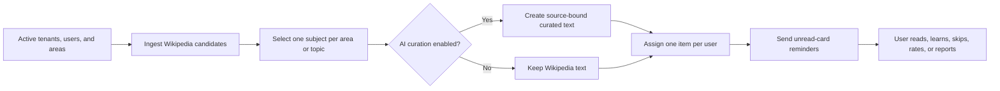

# Narau

Narau is a micro-learning app that gives each user one small, well-sourced thing to learn every day.

It is a TypeScript monorepo containing a Next.js web application, a Bun worker for content ingestion and daily assignment, shared packages, and a Docker Compose development stack.

## Stack

- **Monorepo:** Bun workspaces and Turborepo
- **Web:** Next.js App Router, React, TypeScript, Tailwind CSS, Radix UI
- **Worker:** Bun, BullMQ, Redis, and a typed Wikipedia client
- **Data:** PostgreSQL 16 and Prisma
- **Authentication:** Auth.js magic links through SMTP
- **Local infrastructure:** Docker Compose, Mailpit, and MinIO

## Prerequisites

- Docker Desktop with Docker Compose v2
- Bun 1.2 or newer for local development
- Node.js 20 or newer for tools that invoke Node directly

Docker is the recommended way to run the complete application. The repository has one Compose file, located at [`docker/docker-compose.yml`](docker/docker-compose.yml), and one application image definition at [`docker/Dockerfile`](docker/Dockerfile).

## Run the complete stack

From the repository root:

```bash
docker compose -f docker/docker-compose.yml up -d --build
```

The stack exposes:

| Service       | URL or port           | Purpose                |
| ------------- | --------------------- | ---------------------- |
| Web           | http://localhost:3030 | Narau application      |
| PostgreSQL    | `localhost:5434`      | Application database   |
| Redis         | `localhost:6379`      | Queues and cache       |
| Mailpit       | http://localhost:8025 | Local email inbox      |
| SMTP          | `localhost:1025`      | Local SMTP server      |
| MinIO API     | http://localhost:9000 | S3-compatible storage  |
| MinIO console | http://localhost:9001 | Storage administration |

The `migrate` service uses the same `narau-web` image as the web service, applies Prisma migrations, and seeds a fresh database before the web service starts. To inspect the services or follow application logs:

```bash
docker compose -f docker/docker-compose.yml ps
docker compose -f docker/docker-compose.yml logs -f web
```

### Tenants and language routes

Each tenant is a language-specific content boundary. Its unique slug is also its public route, so a tenant such as `pt-br` is served at `/pt-br`, `/pt-br/today`, and `/pt-br/admin`. The route is resolved from the database; adding a tenant does not require adding a code constant or changing the router.

Administrators manage tenants at `/en/admin/tenants` (or the equivalent route for the current tenant). Open a tenant's content from that page to work inside its isolated catalog. Areas, subjects, candidates, daily selections, assignments, reports, and learning history are tenant-scoped at both the application and database boundaries.

The ingestion, selection, assignment, and reminder workers are shared. They iterate over active tenants and use each tenant's language tag for its Wikipedia source. Regional tags such as `pt-br` map to the `pt` Wikipedia project while remaining a distinct tenant route.

The equivalent shortcuts are:

```bash
bun run docker:up
bun run docker:down
```

## Local development

Use Docker for infrastructure and run the web app from the host for fast reloads:

```bash
cp .env.example .env
bun install
docker compose -f docker/docker-compose.yml up -d db redis mailpit minio minio-init
bun run db:migrate
bun run db:seed
bun run dev
```

The web app runs at http://localhost:3030. Start the worker in a second terminal when worker processing is needed:

```bash
bun run worker:dev
```

## Tests and quality checks

Tests must run through Docker Compose, using the `test` service. Do not run `bun run test` directly on the host; the Compose service is the canonical local and CI environment.

Build the test image after dependency changes, then run the complete repository suite:

```bash
docker compose -f docker/docker-compose.yml --profile test build test
docker compose -f docker/docker-compose.yml --profile test run --rm test
```

To run only the web workspace while developing a test:

```bash
docker compose -f docker/docker-compose.yml --profile test run --rm test bun --filter @narau/web test
```

Linting and TypeScript checks also run through the same Compose service:

```bash
docker compose -f docker/docker-compose.yml --profile test run --rm test bun run lint
docker compose -f docker/docker-compose.yml --profile test run --rm test bun run typecheck
```

The web tests use Vitest for server behavior and React Testing Library for accessible user interactions. They mock PostgreSQL, Auth.js, Wikipedia, SMTP, and LLM boundaries. Docker Compose starts an isolated test container but does not start the infrastructure services or make external requests for this suite.

## Daily content pipeline

Narau creates the daily learning experience in stages. The worker first discovers Wikipedia pages, then publishes one page per active learning node, optionally curates that publication with AI, assigns one suitable publication to each user, and finally sends reminders for unread cards.



### Prerequisites

Before running the pipeline, make sure that:

- the database, Redis, and the application stack are running;
- the tenant is `ACTIVE` and has the correct language, such as `en`, `es`, or `pt`;
- the area, topic, or specialty is `ACTIVE` and has at least one Wikipedia category in its source configuration;
- users are `ACTIVE` and have at least one effectively active learning selection;
- `WIKIPEDIA_USER_AGENT` identifies Narau and `WIKIPEDIA_REQUEST_DELAY_MS` is appropriate for the deployment;
- `LLM_SETTINGS_ENCRYPTION_KEY` is configured in both the web and worker containers if AI curation is enabled.

The ingestion and selection workers are tenant-aware. They process all active tenants, use the tenant's language for Wikipedia, and keep all subjects, candidates, daily publications, and assignments inside that tenant. A regional tenant such as `pt-br` remains a separate route but uses the `pt` Wikipedia project.

### Run the complete flow manually

After the Docker stack has been built, run these commands in order from the repository root:

```bash
docker compose -f docker/docker-compose.yml exec web bun run job:ingest
docker compose -f docker/docker-compose.yml exec web bun run job:select
docker compose -f docker/docker-compose.yml exec web bun run job:assign
docker compose -f docker/docker-compose.yml exec web bun run job:remind
```

The commands run in the `web` container because it contains the compiled worker CLI and the full application runtime. They execute the job directly in the foreground; they do not add a job to the BullMQ queue.

To run ingestion, selection, or assignment for a specific UTC content date, call the compiled CLI directly:

```bash
docker compose -f docker/docker-compose.yml exec web bun apps/worker/dist/cli.js ingest-area-candidates --date=2026-08-06
docker compose -f docker/docker-compose.yml exec web bun apps/worker/dist/cli.js select-daily-subjects --date=2026-08-06
docker compose -f docker/docker-compose.yml exec web bun apps/worker/dist/cli.js assign-user-daily-items --date=2026-08-06
```

The reminder job always operates on the current UTC day and does not use the CLI date argument. For host-based development, build the worker first and then use the equivalent root scripts:

```bash
bun run worker:build
bun run job:ingest
bun run job:select
bun run job:assign
bun run job:remind
```

### What each stage does

#### 1. Ingest Wikipedia candidates

- Command: `job:ingest`
- Internal job: `ingest.area-candidates`
- Implementation: `apps/worker/src/services/wikipedia-ingestion.ts`

For every active area, topic, and specialty in every active tenant, ingestion:

1. Reads the node's Wikipedia category configuration.
2. Keeps the most specific configured category as the primary research category.
3. Converts the category to the tenant's Wikipedia language.
4. Fetches category members and page details from the correct Wikipedia project.
5. Removes non-article pages, short extracts, lists, disambiguation pages, and excluded categories.
6. Normalizes the title, extract, hook, image, revision, and canonical URL.
7. Scores the page using source quality, summary length, image availability, definitional content, and category information.
8. Creates or updates the tenant's `Subject` record.
9. Creates an `AreaSubjectCandidate` for the requested content date.

The result reports the number of processed areas, newly created candidates, and per-area errors. Ingestion is safe to repeat for the same date: existing `(area, subject, date)` candidates are preserved and subjects are updated with the latest Wikipedia revision data.

Ingestion is intentionally rate-limited and processes areas sequentially. A long pause after an `ingestion area started` message generally means that the worker is waiting for Wikipedia category or page-detail requests. The configured request delay has a major effect on total runtime.

#### 2. Select one daily subject per learning node

- Command: `job:select`
- Internal job: `daily.select-area-subjects`
- Implementation: `apps/worker/src/services/subject-selection.ts`

For every active area, topic, and specialty, selection:

1. Loads candidates generated for the requested content date.
2. Ignores inactive subjects and candidates used by that node in the recent selection window.
3. Excludes subjects selected for that node during the previous 30 days when alternatives exist.
4. Ranks candidates by score and randomizes ties.
5. Publishes exactly one `DailyAreaSubject` for the node and date.
6. Marks the winner `SELECTED` and the remaining candidates `REJECTED`.

The result is one shared publication per active learning node, not one publication per user. This is what allows users with the same selection to learn the same subject on the same day without duplicating the content record.

An administrator override is preserved: daily subjects whose `selectedBy` value starts with `admin:` are not replaced by the worker.

If no valid candidate remains, the node is reported in `skipped` and no daily publication is created. In that case, assignment cannot produce a card for users who depend on that node.

Do not casually rerun selection after assignment. Worker selection uses a random tie-breaker and can replace a previous worker-selected publication when another valid candidate is available. If a date must remain fixed, use the admin daily-subject override before assigning users.

#### 3. Curate the selected publication with AI

AI curation runs inside `job:select` immediately after daily selection; there is no separate curation command.

When AI curation is enabled in the admin settings, the worker sends the selected Wikipedia title, canonical URL, language, and source text to the configured provider. Narau supports:

- OpenAI and Gemini through strict JSON Schema output;
- DeepSeek through JSON mode followed by Narau's local source-fidelity, markup, number, minimum-length, and reading-time validation.

The curated text is stored once on `DailyAreaSubject` and shared by all users receiving that publication. The provider, model, prompt version, source revision, and curation status are recorded for traceability.

If curation fails, the daily publication is marked `FAILED` and readers continue to receive the original Wikipedia text. AI curation is configured at the global admin level; it is not a per-user operation.

Configure it at `/en/admin/settings` or the equivalent tenant route. The provider API key is stored encrypted in the database. `LLM_SETTINGS_ENCRYPTION_KEY` is the server-side encryption secret, not the provider API key.

#### 4. Assign one item to each user

- Command: `job:assign`
- Internal job: `daily.assign-user-items`
- Implementation: `apps/worker/src/services/user-assignment.ts`

For every active user in every active tenant, assignment:

1. Loads the user's selected areas, topics, and specialties.
2. Removes selections that are inactive or have an inactive ancestor.
3. Loads the published daily subjects for those exact learning nodes.
4. Excludes subjects the user has already marked as learned.
5. Uses the shared daily-card selection algorithm to choose one eligible subject.
6. Creates one `UserDailyItem` for the user and content date.

The database enforces one item per user per content date. Running assignment again is safe for users who already have an item: they are counted as skipped. Users with no effective active selection, no daily publication, or no eligible unread subject receive no new item and should be investigated through the admin areas, daily subjects, and user-selection screens.

#### 5. Send reminders for unread items

- Command: `job:remind`
- Internal job: `notify.daily-reminder`
- Implementation: `apps/worker/src/jobs/send-daily-reminders.ts`

The reminder job finds `PENDING` items for the current UTC day, renders the localized email, uses the AI-curated text when available, and sends the message through SMTP. It continues sending after an individual failure and reports failed user IDs in its result.

In local development, inspect sent messages in Mailpit at http://localhost:8025. The reminder query is based on `PENDING` status, so rerunning it can send another reminder for the same unread item.

### Automatic schedule

The long-running worker is started by Docker Compose. On startup it registers the BullMQ repeatable schedules and then listens on the `narau` queue. The current schedules are:

| Approximate UTC time | Internal job                 | Effect                                                   |
| -------------------- | ---------------------------- | -------------------------------------------------------- |
| 00:00                | `ingest.area-candidates`     | Refresh Wikipedia subjects and create today's candidates |
| 00:20                | `daily.select-area-subjects` | Publish one subject per active node and run AI curation  |
| 00:40                | `daily.assign-user-items`    | Assign one eligible item to each active user             |
| 08:00                | `notify.daily-reminder`      | Email users whose item is still unread                   |

These schedules are defined in `apps/worker/src/lib/queue.ts`. The application's content dates are UTC dates, so verify the container clock when deploying to another environment. The scheduler is registered every time the worker starts, but the scheduler IDs are stable and are upserted rather than duplicated.

To confirm that the scheduled worker is alive:

```bash
docker compose -f docker/docker-compose.yml ps
docker compose -f docker/docker-compose.yml logs -f worker
```

You should see `worker started` followed by `worker ready`. Scheduled job logs include `job started`, `job finished`, counts, and errors.

### Records created throughout the flow

The pipeline moves through these tenant-scoped records:

| Record                 | Created or changed by   | Purpose                                                                                             |
| ---------------------- | ----------------------- | --------------------------------------------------------------------------------------------------- |
| `Subject`              | Ingestion               | One normalized Wikipedia article and its latest source metadata                                     |
| `AreaSubjectCandidate` | Ingestion and selection | A dated candidate for one learning node; normally becomes `SELECTED` or `REJECTED`                  |
| `DailyAreaSubject`     | Selection               | One shared publication for one node and content date; also stores AI-curated content and provenance |
| `UserDailyItem`        | Assignment              | One user's selected card for the content date and its learning status                               |
| Email delivery         | Reminder                | Sends the user's unread daily item through SMTP                                                     |

User item statuses then track the learning lifecycle: `PENDING`, `VIEWED`, `LEARNED`, `SKIPPED`, `MISSED`, or `REPLACED`.

### Troubleshooting a missing card

Use the stages in order; later stages cannot create data that an earlier stage did not produce.

1. Check `docker compose ... ps` and confirm that `db`, `redis`, `web`, and `worker` are running.
2. Run `job:ingest` and inspect its final result. Confirm that `areas` is greater than zero and that candidates were created.
3. Open the admin Candidates page and verify that the target tenant and node have candidates for the requested date.
4. Run `job:select` and inspect the `selected` and `skipped` counts. A skipped node usually has no eligible candidate, an inactive subject, a recent-use exclusion, or an existing admin override.
5. Open the admin Subjects page and confirm a `PUBLISHED` daily subject exists for the date.
6. Run `job:assign` and inspect `assigned`, `skipped`, and `errors`.
7. Confirm the user is active and has an effectively active area, topic, or specialty under the same tenant.
8. Open the user's Today page. The daily card is selected from the user's configured nodes, not directly from the Wikipedia source URL.
9. Run `job:remind` and inspect Mailpit if the problem is email delivery rather than card assignment.

For a one-off command executed with `docker compose exec web`, the logs appear in the terminal running that command. They do not appear in `docker compose logs worker`, because that command starts a separate foreground process in the web container. Use worker logs for scheduled jobs and terminal output for manual jobs.

## Production build check

After the Compose-based tests, linting, and type checks pass, rebuild the complete stack as the required integration check:

```bash
docker compose -f docker/docker-compose.yml up -d --build
```

## Project layout

```text
apps/
  web/                 Next.js application and admin backoffice
  worker/              BullMQ worker and job processors
packages/
  analytics/           Event names and tracking helpers
  config/              Shared ESLint and TypeScript configuration
  content-normalizer/  Content cleaning, truncation, and hashing
  database/            Prisma schema, migrations, client, and seed
  email/               SMTP transport
  ui/                  Shared UI components and styles
  validation/          Shared Zod schemas
  wikipedia-client/    Typed Wikipedia REST client
docker/
  Dockerfile           Multi-stage production image
  docker-compose.yml   Single Compose definition for local infrastructure and the full stack
docs/                  Product, design, and [system architecture](docs/architecture.md) documentation
tests/                 Repository-level structural tests
```

Dependencies and build output are intentionally not part of the repository. `node_modules`, `.next`, `.turbo`, and `dist` are ignored locally and excluded from Docker build contexts by [`.dockerignore`](.dockerignore).

## Multi-tenant architecture and internationalization

Narau is organized by language tenant:

- Tenants are represented by language codes: `en`, `es`, and `pt`.
- Areas, subjects, and users are bound to a tenant.
- Composite unique keys preserve tenant isolation.
- Ingestion uses the Wikipedia API for the tenant's language.
- UI translations are stored in `apps/web/public/locales/`.

## License

Content shown to users is Wikipedia content under [CC BY-SA 4.0](https://creativecommons.org/licenses/by-sa/4.0/) and links back to its source article. Code is MIT unless stated otherwise.
