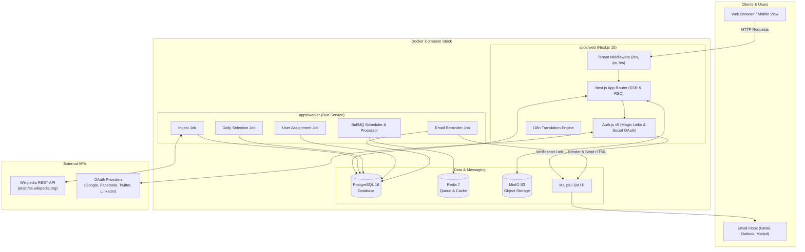
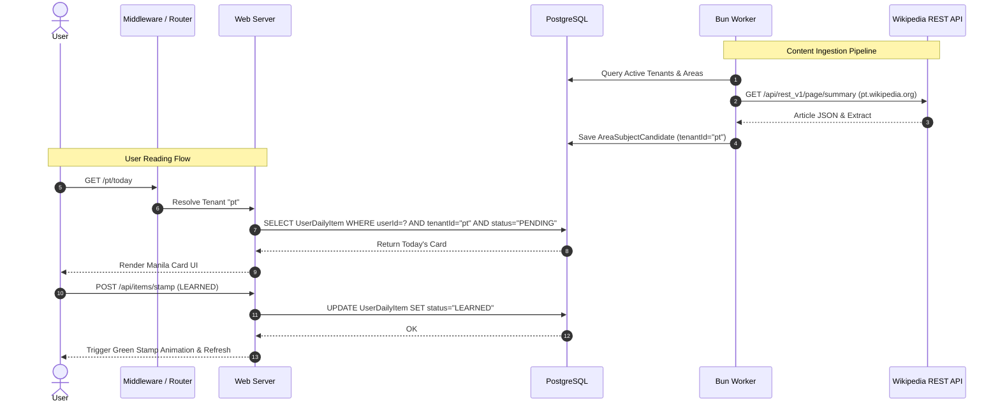
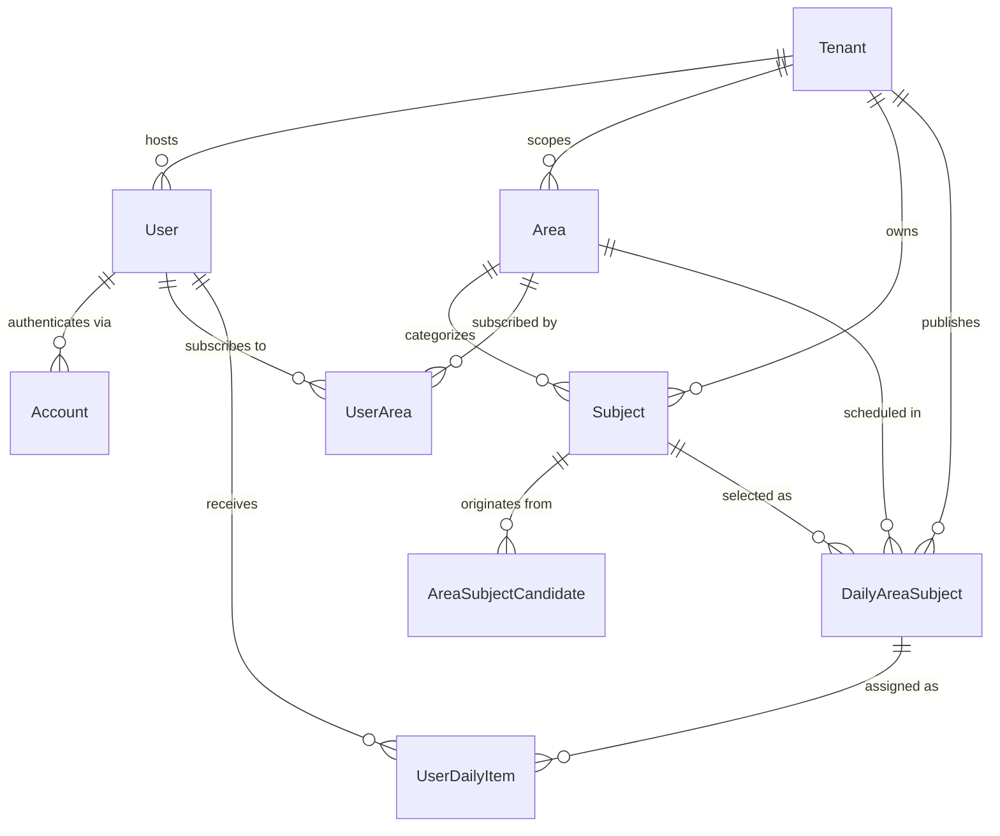

# Narau Microlearning — System Architecture

This document details the architecture, data flow, component boundaries, and infrastructure of the Narau Microlearning platform.

---

## 1. Overview

Narau is an editorial microlearning platform that delivers one small, well-sourced learning card to each user every day. The system features multi-tenant content isolation supporting multiple language tenants (e.g., `en`, `pt`, `es`), automated Wikipedia ingestion pipelines, customizable interest areas, and daily assignment scheduling.

The project is structured as a single monorepo managed with **Bun Workspaces** and **Turborepo**, deployed via **Docker Compose**.

---

## 2. Monorepo Structure

```
narau-microlearning/
├── apps/
│   ├── web/                    # Next.js 15 App Router web application
│   └── worker/                 # Bun & BullMQ background job processing service
├── packages/
│   ├── database/               # Prisma schema, PostgreSQL client & migrations
│   ├── email/                  # Nodemailer transport & HTML template renderers
│   ├── wikipedia-client/       # Typed client for localized Wikipedia APIs
│   ├── content-normalizer/     # HTML sanitization & card text normalization
│   ├── ui/                     # Shared UI design system & Tailwind components
│   ├── validation/             # Shared Zod validation schemas
│   ├── analytics/              # Event tracking interfaces
│   └── config/                 # Common ESLint, Prettier, & TSConfig definitions
├── docs/                       # Architecture, PRD, & Design documentation
└── docker/                     # Dockerfile & Docker Compose stack
```

---

### 2.1 Frontend vs Backend Categorization

| Tier | Components & Packages | Responsibilities |
| --- | --- | --- |
| **Frontend** | `apps/web/src/app/(UI pages)`<br>`packages/ui`<br>`apps/web/public/locales/` | Client views (Today Manila Card, Reading Room, Dashboard, Onboarding, Settings, Admin Backoffice), UI components, Tailwind CSS styling, client-side i18n context, and stamp animations. |
| **Backend** | `apps/worker`<br>`apps/web/src/app/api/`<br>`apps/web/src/server/`<br>`packages/email`<br>`packages/wikipedia-client`<br>`packages/content-normalizer` | Server API Route handlers, Auth.js authentication, tenant routing middleware, BullMQ job worker (`ingest`, `select`, `assign`, `remind`), Nodemailer email rendering/sending, Wikipedia API integration, and HTML text sanitization. |
| **Shared / Data Layer** | `packages/database`<br>`packages/validation`<br>`packages/analytics`<br>`packages/config` | PostgreSQL database connection & Prisma ORM schemas, shared Zod validation schemas, event tracking definitions, and ESLint/TypeScript configurations. |

---

## 3. High-Level Architecture Diagram



---

## 4. Component Deep Dive

### 4.1 Applications (`apps/`)

#### `apps/web` (Next.js 15 Web Application)
- **Framework**: Next.js 15 App Router with React 19, TypeScript, and Tailwind CSS.
- **Routing**: Multi-tenant slug routing (`/[locale]/...`). Slug routes like `/en/today` or `/pt/admin` are resolved dynamically against tenant records in PostgreSQL.
- **Authentication**: Auth.js (NextAuth v5) supporting SMTP Magic Links and Social OAuth (Google, Facebook/Instagram, Twitter/X, LinkedIn). Uses `PrismaAdapter` with custom `tenantAwareAdapter` wrapper to bind new users to the active tenant.
- **i18n**: Client and server internationalization loading translation dictionaries (`en.json`, `pt.json`, `es.json`).

#### `apps/worker` (Bun Background Worker)
- **Runtime**: Bun JavaScript runtime executing BullMQ workers connected to Redis.
- **Jobs**:
  1. **`ingest`**: Fetches featured and trending articles from language-specific Wikipedia endpoints (`en.wikipedia.org`, `pt.wikipedia.org`, `es.wikipedia.org`), normalizes text, and creates candidate entries (`AreaSubjectCandidate`).
  2. **`select`**: Evaluates candidates based on quality scores, readability, and recency, publishing one daily subject (`DailyAreaSubject`) per area.
  3. **`assign`**: Matches active users to published daily subjects based on their subscribed interest areas (`UserDailyItem`).
  4. **`remind`**: Finds unlearned pending items for the current day and sends HTML reminder emails via `@narau/email`.

---

### 4.2 Shared Packages (`packages/`)

- **`@narau/database`**: Prisma ORM models and database connection pool. Enforces tenant boundaries via composite unique indexes on `tenantId` across `Area`, `Subject`, `User`, `UserDailyItem`, and `DailyAreaSubject`.
- **`@narau/email`**: SMTP transport configured via environment variables and responsive HTML templates (`renderDailyLearnEmail`, `renderWelcomeEmail`, `renderPasswordResetEmail`, `renderMagicLinkEmail`).
- **`@narau/wikipedia-client`**: Strongly typed REST client querying Wikipedia summary, page content, and image metadata per language subdomain.
- **`@narau/content-normalizer`**: Cleans Wikipedia HTML into microlearning card sections (Extract, Key Takeaways, See Also references, and reading time estimation).
- **`@narau/ui`**: Design system components built with Radix UI primitives and custom CSS styled according to the Manila card paper-and-ink visual theme.
- **`@narau/validation`**: Zod validation schemas shared between client form inputs and server API endpoints.

---

## 5. Multi-Tenant Architecture & Data Flow

Every tenant represents an isolated language and content catalog boundary (e.g., English `en`, Portuguese `pt`, Spanish `es`).



---

## 6. Data Model Relationship Diagram



---

## 7. Development & Production Deployment

- **Containerization**: Single multi-stage [`docker/Dockerfile`](../docker/Dockerfile) compiles monorepo packages, runs Prisma engine optimization for Next.js standalone output, and runs Bun.
- **Orchestration**: [`docker/docker-compose.yml`](../docker/docker-compose.yml) provisions:
  - `web` (Next.js Application on port `3030`)
  - `migrate` (Prisma DB migration runner)
  - `db` (PostgreSQL 16 on port `5434`)
  - `redis` (Redis 7 on port `6379`)
  - `mailpit` (Local SMTP & Web Email Inbox on port `8025`)
  - `minio` (S3 Object Storage on port `9000` & Console on `9001`)
